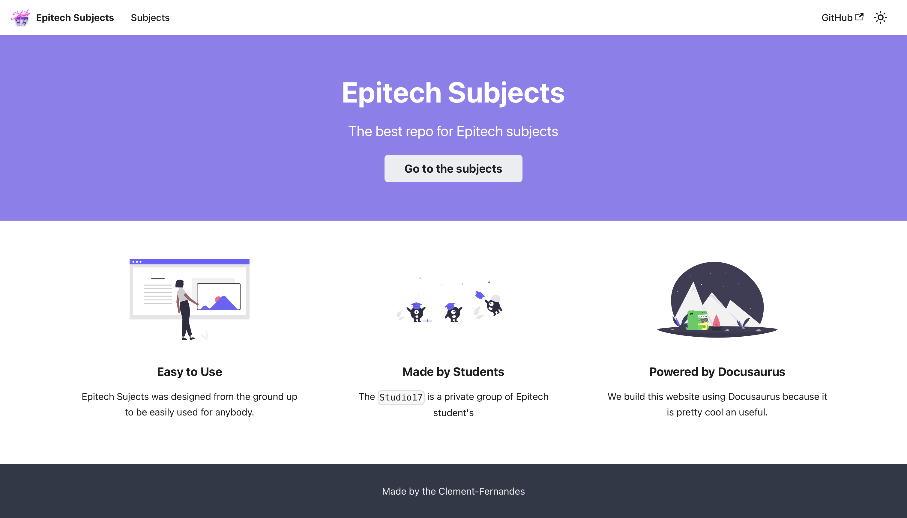

# Epitech-Subjects Website

> The website is available at [https://clement-fernandes.github.io/epitech-subjects-website/](https://clement-fernandes.github.io/epitech-subjects-website/)

## Preview


**This website is built using [Docusaurus](https://github.com/facebook/docusaurus) and all the documents from the [Epitech-Subjects](https://github.com/Studio-17/Epitech-Subjects) repository.**

---

## Local Development

```
$ npm install
$ npm start
```

This command starts a local development server and opens up a browser window. Most changes are reflected live without having to restart the server.

**Thank you for your interest in this project. :smile:**
